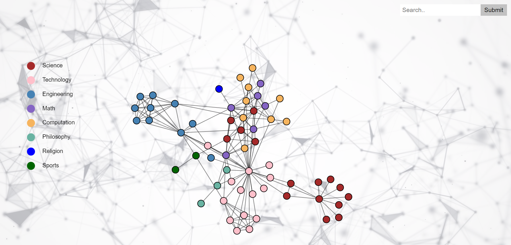
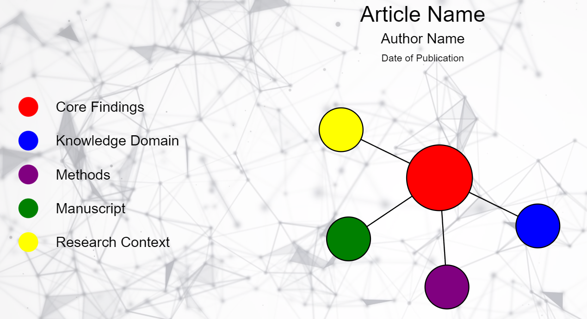

# schonograph-D3-Branch2

ASU Navigation and Visualization Capstone Project

In developing the Smart Knowledge Navigation and Discovery Platform for Arizona State University, it was our team's goal to create a prototype for a
program that could webscrape and sift through academic papers, parsing them in a manner that was maximally user intuitive. We made extensive use of Node.JS and the D3
library to produce quality visualizations and interactive tools which could be used to effectively disseminated aggregated local data. Our program also directly
interfacted with OpenAI's Summarizer API, utilizing exciting new artificial intelligence technology to show what modern JS can be capable of even at the consumer level.

*Figure 1 - Home Page Node Structure*

*Figure 2 - Post-Parse Article Node Structure*

*Figure 3 - Example Node of Article Summary*
